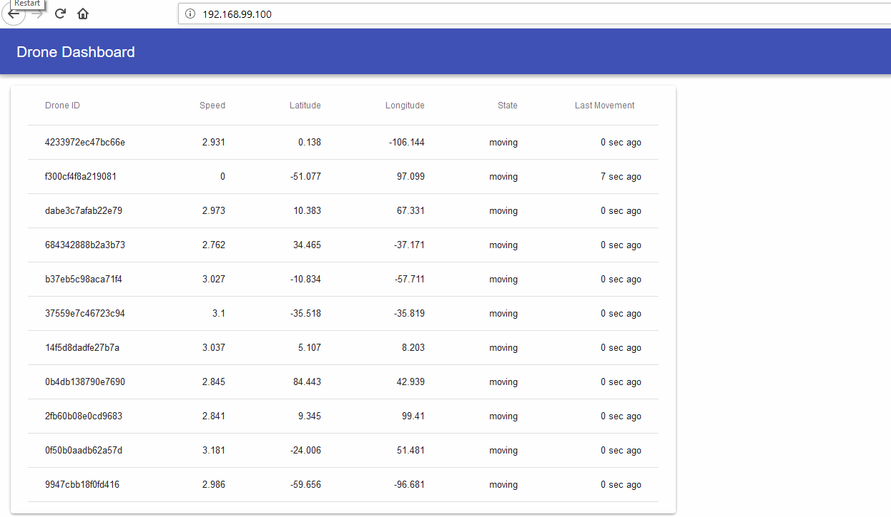
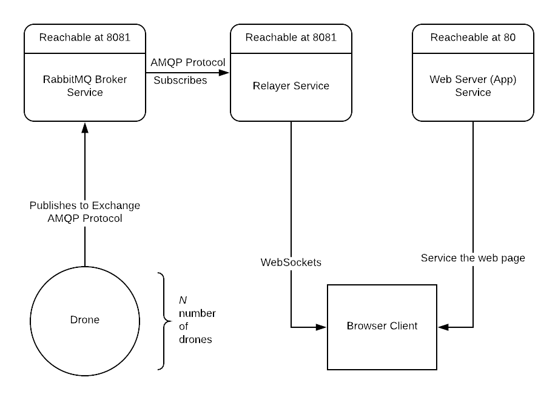

# Simulated Fleet of Drones with Web App

## Succind Description

This repository represents a collection of services built with docker that together simulate a fleet of drones that report to a central broker which then relays the data to a web app.



## Background Story

A company has a number of drones flying around the country and there's a need for a system to track the location of every drone in real-time. The system's dashboard will report the following:

1. The last geolocation of its drones - longitude and latitude.

1. Each drone's unique identifier.

1. Each drone's speed.

The dashboard should be a simple single-page application displaying the list of active drones, by their unique identifier along with the other data mentioned before. Those drones that have not been moving for more than 10 seconds have to be visually highlighted.

The backend doesn't need to worry about the history, so the data can be stored in-memory, because it's simpler and it beats the purpose in this scenario.

Since each drone uses cellular connections and because these are expensive, the drones must report back their location using as little data as possible.

## Getting Started

First things first - clone the repo and change the directory to the root of the project within a terminal session.

### Development

To build the development environment run
```bash
docker-compose -f docker-compose.yml -f docker-compose.dev.yml -f docker-compose.mounts-dev.yml build
```
This will build the following images:

1. _robertlucian/drones-rabbitmq_ - message broker service to which the other services connect to - the data it collects are sent to each additional connected relayer.
1. _robertlucian/drones-drone-producer_ - drone simulator which creates fake data that gets published to the message broker.
1. _robertlucian/drones-webapp_ - the web app which is the dashboard in the above GIF.
1. _robertlucian/drones-relayer_ - service to relay the data it gets from the message broker to each browser client.


To start the development environment run
```bash
docker-compose -f docker-compose.yml -f docker-compose.dev.yml -f docker-compose.mounts-dev.yml up
```

And then to stop it, run
```bash
docker-compose down -v
```
Use `-v` option in case you want to remove the persistent volumes which are used to store the NPM packages. It's better to have them put in a volume and leave out the source code to the project.

#### What do these development images have?

They've got their linters in it, they've got `nodemon` which comes real handy in hot reloading the source code, there are bind mounts that bind to this project so you can edit in real time each service, separate volumes for each service for `node_modules` directory. This is so that the project's directory doesn't get bloated with packages - I kinda prefer it this way - it isolates the environments completely.

### Production

To build the production environment run
```bash
docker-compose build
```

This will build the same 4 images as in the development phase, though these will be significantly smaller than the other ones and use less resources when run.

Obviously, to start it just run
```bash
docker-compose up
# or
docker-compose up --scale producer=10 # in order to have more drones
# or
docker-compose up --scale producer=10 --scale slow-producer=2 # to also have slow-moving drones
```
 and when stopping it a `docker-compose stop` is enough.

Note: The production images don't require any volumes or bind mounts.

### Accessing the Dashboard

If you're running on Win10 Pro, the dashboard can be accessed at `localhost` URL and if you have the Docker Toolbox on the Home edition, use the IP address of the VM. The dashboard is accessible at port 80. And make sure you don't have anything else running on port 80.

### Accessing the RabbitMQ Management

To access the RabbitMQ Management Dashboard, go to `localhost:8080` or `192.168.99.100:8080` (or whatever IP your VM has with the toolbox).

### Docker Hub

If you want to skip building the images, then you can `docker pull` them:
```bash
docker pull robertlucian/drones-rabbitmq
docker pull robertlucian/drones-drone-producer
docker pull robertlucian/drones-webapp
docker pull robertlucian/drones-relayer
```

## Tech Stack

1. **RabbitMQ** - a message broker using a lightweight protocol AMQP which is recommended for IoT projects because it has a strong focus on having a minimal wire footprint and because it's simple.

1. **NodeJS** - because I'd only have to deal with one language: JS for backend and frontend. Python is a really good other option, but I have used it in way too many projects for now.

1. **React** - nice front-end framework.

1. **Material-UI** - front-end framework and goes hand in hand with React

1. **Docker** - need I say more?

## More On These Services



### The Drone Producer Service - found in ./drone-producer

This is a service which connects to the message broker and publishes every 500ms (or twice per second) the geolocation, the speed of the drone, its ID, the time of the message and the time when it took the "reading". All this is done with a library that generates fake data.

The ID of the drone is actually the container ID in docker but stripped down to 16 characters.

It also accepts an argument to the command line called `--slow-moving-drone` which is used to demonstrate how the dashboard highlights inactive drones.

### The Relayer Service - found in ./relayer

This service subscribes to the message broker's exchange and then relays to each connected browser client the drones' data. It uses websockets for that and for this matter, it's a completely separate service from the web app. Because of this, whatever the web server serves is dependent on the functionality of this service.

This service continuously updates its list of active drones and those that haven't been updated for more than 10 seconds are discarded - it's considered the drone has lost connection to the broker. At the same time, the other drones are updated by their ID.

At the same time, there's an HTTP server (websockets) that periodically (2 times/s) sends data to all browser clients of the list of active drones (that gets updated with each new push from the message broker).

Theoretically, multiple instances of this service could be launched to distribute the load in case there are too many clients.
